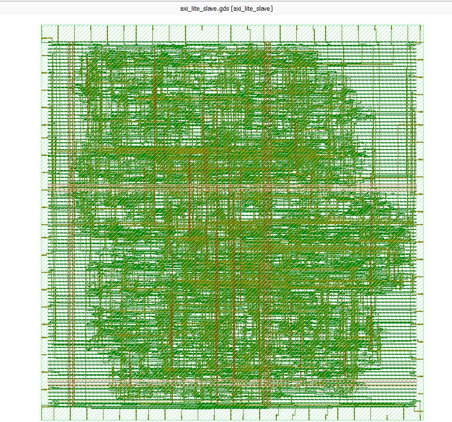

# AXI4-Lite Slave — RTL to GDSII (OpenROAD / sky130)

Physical implementation of a UVM-verified AXI4-Lite slave, taken from RTL through
a complete RTL-to-GDSII flow on the open-source OpenROAD/OpenLane toolchain,
targeting the SkyWater 130nm (sky130) PDK.

The RTL was independently verified beforehand with a UVM-1.2 testbench
(46 transactions, 0 scoreboard errors, non-vacuous coverage — see
[axi-lite-uvm-verification](#) for that work). This repo covers what happens
after verification: synthesis, floorplanning, placement, clock tree synthesis,
routing, and signoff.

## Design

A memory-mapped AXI4-Lite slave with a 16 x 32-bit register file, supporting
single-beat read/write transactions with byte-level write strobes (`WSTRB`).
No burst support — that's out of scope for AXI4-Lite by spec.

- `ADDR_WIDTH = 6`, `DATA_WIDTH = 32` → 16 addressable 32-bit words
- Fully synchronous, single clock domain (`ACLK`), active-low async reset (`ARESETn`)
- Independent write and read address/data channel handshakes per the AXI4-Lite protocol

## Flow

| Stage | Tool |
|---|---|
| Synthesis | Yosys |
| Floorplan / Placement / CTS / Routing | OpenROAD |
| Static timing analysis | OpenSTA |
| DRC | Magic |
| LVS | Netgen |
| GDSII viewing | KLayout |

Flow orchestrated via OpenLane 2, sky130_fd_sc_hd standard cell library.

## Results

| Metric | Value |
|---|---|
| Target clock period | 10 ns (100 MHz) |
| Worst setup slack | +5.97 ns (MET) |
| Worst hold slack | MET, no violations |
| Core utilization | 35% |
| DRC | Clean — 0 violations |
| LVS | Clean — 0 mismatches (net, device, pin, property) |

Setup slack came in with significant margin at the initial target, which is
expected for a design this small — the register file and channel handshake
logic don't build up much combinational depth. That margin is worth exploiting:
tightening `CLOCK_PERIOD` well below 10ns is the natural next step if a higher
max-frequency number is wanted for the writeup.

## Final layout



Full-chip GDSII view in KLayout, sky130_fd_sc_hd standard cells.

## Debug notes: fanout vs. timing

The first signoff pass flagged a large number of `max_fanout` violations
against the sky130_fd_sc_hd limit of 10. Worth documenting because it's a
useful distinction for anyone reading the reports cold:

- **Real issue:** `ARESETn` is wired directly to every flop's async reset pin.
  With ~190 flops in the design and one reset driver, that's a genuine
  high-fanout net that synthesis doesn't buffer by default. Setting
  `SYNTH_MAX_FANOUT` in the OpenLane config forces Yosys to insert a buffer
  tree for it — measured fanout per net dropped from ~20 down to ~8 after
  tuning this.
- **Not a real issue:** most of the remaining flagged nets are `clkbuf_*` —
  the clock tree buffers OpenROAD's CTS stage inserts on `ACLK`. A clock
  buffer fanning out to 16-20 leaf loads is exactly what it's built to do;
  the generic liberty `max_fanout` check doesn't carve out an exception for
  clock nets the way a production signoff flow would. These are expected and
  don't indicate a design problem — timing closure (the metric that actually
  matters) was unaffected throughout.

This is the kind of thing that's easy to over-fix by chasing a warning count
to zero. The right call here was to fix the reset fanout (real, cheap to fix)
and leave the clock tree fanout alone (expected, not fixable via synthesis
tuning without restructuring CTS itself).

## Repository structure

```
├── src/
│   └── axi_lite_slave.sv       # DUT RTL
├── config.json                 # OpenLane flow configuration
├── results/
│   ├── final/gds/               # Final GDSII
│   └── signoff/                 # STA, DRC, LVS reports
├── docs/
│   └── layout.png               # Final layout screenshot
└── README.md
```

## Reproducing this flow

```bash
git clone https://github.com/The-OpenROAD-Project/OpenLane.git
cd OpenLane && make && make pdk
git clone https://github.com/Archit-y/axi-lite-rtl2gds.git designs/axi_lite_ctrl
make mount
./flow.tcl -design axi_lite_ctrl
```

## Tools

OpenROAD, OpenLane 2, Yosys, OpenSTA, Magic, Netgen, KLayout — sky130_fd_sc_hd PDK.
